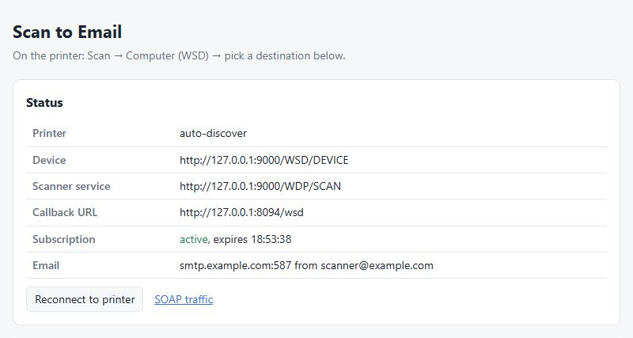
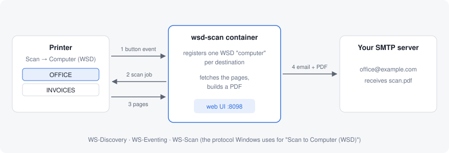
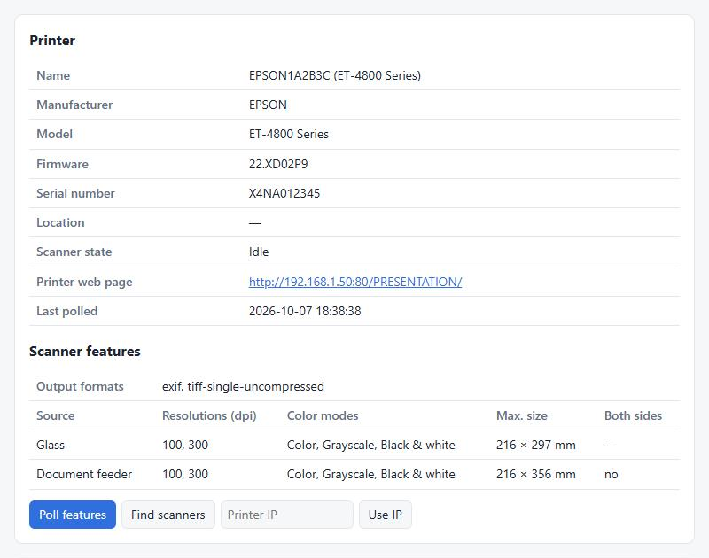
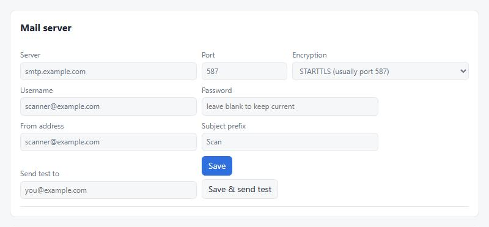
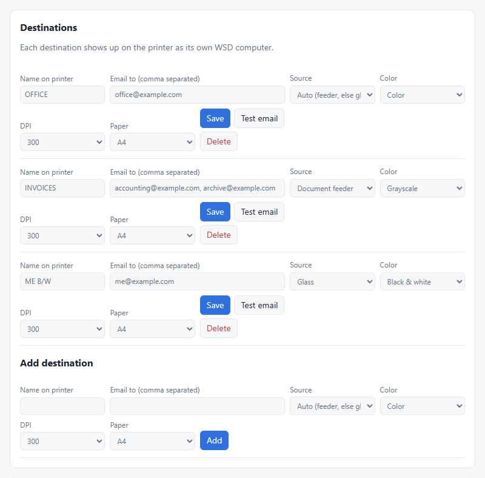
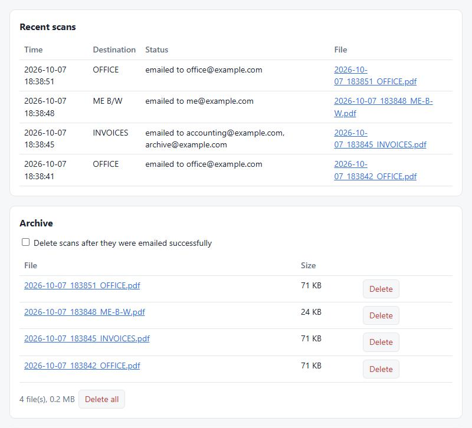
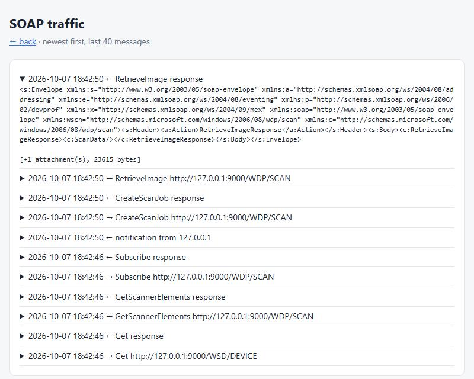

# EPSON ET-4800 WSD Scan to Mail

Scan-to-email for printers that don't have it, such as the **Epson EcoTank ET-4800**.

Press **Scan → Computer (WSD)** on the printer, pick a name like `OFFICE`, and the scan
arrives as a PDF in your inbox. No PC, no Epson software, no cloud. A small Docker
container on your home server pretends to be a Windows PC for the printer and
emails what it receives through your own SMTP server.



## Features

- **Scan from the printer's own button.** Every destination you configure shows up
  on the printer's panel as its own "computer".
- **Several destinations,** each with its own recipients, source, color mode,
  resolution and paper size.
- **Feeder, glass and duplex.** Multi-page feeder scans become one PDF; *Auto* tries
  the feeder first and falls back to the glass.
- **Black & white mode** (1-bit TIFF from the scanner, so the PDFs stay tiny).
- **Printer features at a glance.** *Poll features* reads model, firmware, serial
  number, state and every scan capability straight from the printer.
- **Finds printers on the network.** No need to know the IP address.
- **Archive of all scans,** with single and bulk delete, or automatic deletion after
  a successful send.
- **Built-in protocol log** to see exactly what the printer says.
- Single Python file, standard library only, runs on the stock `python:3.12-alpine`
  image. No build step.

## How it works



The printer's *Scan to Computer (WSD)* function uses Microsoft's **WS-Scan** protocol,
the same one Windows uses. The container:

1. finds the printer (WS-Discovery) and reads its capabilities,
2. subscribes to the printer's scan events (WS-Eventing) with one display name per
   destination, which is what makes the names appear on the printer's panel,
3. when you press a name on the printer, receives the `ScanAvailableEvent`, creates a
   scan job tuned to the printer's capabilities and downloads the pages,
4. combines the pages into a PDF and sends it by email.

## Requirements

- A printer with **Scan → Computer (WSD)** on its control panel.
- A **Linux** Docker host on the same network, for example **Unraid**, a NAS or a
  Raspberry Pi. The container needs **host networking** so the printer can call it
  back. Docker Desktop on Windows or macOS is not suitable.
- An SMTP server to send the emails with.

## Installation

### Unraid

Open a terminal on Unraid (or connect via SSH):

```bash
git clone https://git.takuya.wtf/TAKUYA/EPSON-ET-4800-WSD-SCAN-TO-MAIL.git /mnt/user/appdata/wsd-scan/app
cp /mnt/user/appdata/wsd-scan/app/unraid/my-wsd-scan.xml /boot/config/plugins/dockerMan/templates-user/
```

If `git` isn't available on your Unraid server, copy `wsdscan.py` to
`/mnt/user/appdata/wsd-scan/app/` and `unraid/my-wsd-scan.xml` to
`/boot/config/plugins/dockerMan/templates-user/` from another computer instead
(for example with `scp`).

Then in the Unraid web UI:

1. **Docker → Add Container**, choose **wsd-scan** from the *Template* list
   (under the user templates).
2. Optionally enter the printer's IP address. You can also find and choose the printer
   later in the web UI.
3. Click **Apply** and open the web UI with the container's icon
   (port **8098** by default).

To update later: `git -C /mnt/user/appdata/wsd-scan/app pull`, then restart the container.

### Docker Compose

```bash
git clone https://git.takuya.wtf/TAKUYA/EPSON-ET-4800-WSD-SCAN-TO-MAIL.git wsd-scan
cd wsd-scan
cp .env.example .env    # optional, see Configuration
docker compose up -d
```

Open `http://<docker-host>:8098`.

## Setup

### 1. Choose the printer

Click **Find scanners** and then **Use this printer**, or type the printer's IP and
click **Use IP**. **Poll features** shows what the printer can do. Resolutions, color
modes and sources in the destination settings follow these capabilities.

Give the printer a fixed IP address (DHCP reservation) in your router.



### 2. Mail server

Enter your SMTP server and send yourself a test email. For Gmail or Outlook, use an
app password.



### 3. Destinations

Every destination is one entry on the printer's panel. The name is what the printer
shows (keep it short). The other settings are applied when you scan.



| Setting | Options |
|---|---|
| Source | *Auto* (feeder, else glass), *Document feeder*, *Document feeder, both sides* (if supported), *Glass* |
| Color | Color, Grayscale, Black & white |
| DPI | Whatever the printer supports (the ET-4800 offers 100 and 300) |
| Paper | A4, Letter, Legal (reduced to the scanner's maximum size) |

### 4. Scan

On the printer: **Scan → Computer (WSD)**, pick your destination, start. The PDF is
saved in the archive and emailed to the destination's recipients.

## Recent scans and archive

Every scan is listed with its result. The PDFs are kept in the archive. Delete them
one by one, all at once, or tick **Delete scans after they were emailed successfully**
so only failed sends are kept.



## Configuration

Everything can be set up in the web UI. Environment variables are optional and mostly
provide initial values:

| Variable | Default | Purpose |
|---|---|---|
| `WEB_PORT` | `8098` | Port of the web UI and of the callback the printer uses |
| `PRINTER_IP` | (none) | Printer to start with; can be changed in the web UI |
| `ADVERTISE_IP` | (detected) | IP of the Docker host as seen by the printer; only set it if the detected *Callback URL* is wrong |
| `WSD_DEVICE_URL` | (none) | Skip discovery and use this device URL directly |
| `DATA_DIR` | `/data` | Settings (`config.json`) and the scan archive (`scans/`) |
| `SMTP_HOST`, `SMTP_PORT`, `SMTP_SECURITY`, `SMTP_USER`, `SMTP_PASS`, `MAIL_FROM`, `MAIL_SUBJECT` | (none) | Initial mail server settings, used on the first start only |
| `MAIL_TO` | (none) | Recipient of the first destination created on the first start |

## Compatibility

Tested with the **Epson ET-4800**. Nothing in the code is specific to it: the scan
settings are built from what the printer reports, so other WSD-capable printers
(other Epson EcoTank, WorkForce and Expression models, and also Brother, Canon, HP and
others) should work too.

- Output formats used, in order of preference: JPEG (`jfif`/`exif`), uncompressed TIFF,
  then the printer's own PDF.
- Black & white needs TIFF or PDF support (JPEG has no 1-bit mode). Otherwise
  grayscale is used.

Quirks found on the ET-4800, handled automatically:

- It rejects requests whose SOAP envelope declares several unused XML namespaces
  (`wscn:OperationFailed`).
- It only offers `exif` JPEG (not `jfif`) and 100 or 300 dpi.
- It grants subscriptions for 15 minutes; the container renews them every 5 minutes.

If your printer behaves differently, the SOAP traffic page (see below) shows what it
rejected. Include that when reporting a problem.

## Troubleshooting



- **The names don't appear on the printer.** Check *Status → Subscription*. If it is not
  active, the error is shown below it. The *Callback URL* must be reachable from the
  printer (the Docker host's LAN IP); otherwise set `ADVERTISE_IP`.
- **A scan fails.** Open **SOAP traffic** (link in the status card). It shows every
  message exchanged with the printer, including its error replies.
- **The printer was restarted.** The names come back within 5 minutes, or immediately
  with **Reconnect to printer**.
- **Find scanners finds nothing.** Discovery needs host networking. Entering the IP
  with **Use IP** works without discovery.

## Security

- The web UI has **no login**. Run it only on a trusted network and don't expose
  port 8098 to the internet.
- The SMTP password is stored in plain text in `config.json` in the data folder.

## License

[GNU General Public License v3.0 or later](LICENSE). You may use, modify and share
this software; if you distribute a modified version, its source code must be made
available under the same license.
